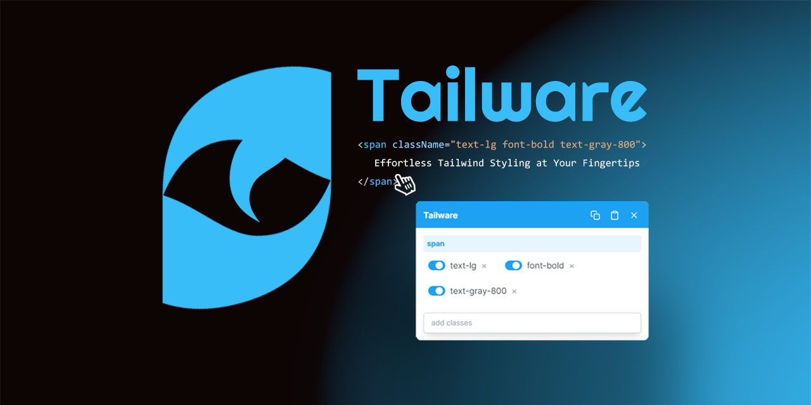

# [](https://github.com/syncinsect/tailware)

[](https://github.com/syncinsect/tailware/blob/main/LICENSE) [](https://github.com/syncinsect/tailware/issues) [](https://github.com/syncinsect/tailware/stargazers)

<!-- [](https://chrome.google.com/webstore/detail/tailware/nimelepbpejjlbmoobocpfnjhihnpked) -->
<!-- [](https://chrome.google.com/webstore/detail/tailware/nimelepbpejjlbmoobocpfnjhihnpked) -->

## What is Tailware?

Tailware is a powerful Chrome extension for real-time inspection and modification of Tailwind CSS classes on web pages. It is designed to enhance the development experience for Tailwind CSS users.

## Free and Open Source

Tailware is committed to remaining free and open source. Here's why we chose to go open source:

1. Serving the Developer Community: Tailware aims to serve developers, designers, and beginners. Open sourcing allows the tech community to better understand and improve this tool, fostering positive project development.

2. Enriching the Tailwind Ecosystem: Through open sourcing, we hope to contribute to and advance the Tailwind CSS ecosystem.

3. Collective Wisdom: We recognize that a single team's capabilities are limited. By open sourcing, we can harness the wisdom of developers worldwide to create a truly useful application.

4. Transparency and Trust: Open sourcing allows users to review the code, ensuring the tool's security and reliability.

We warmly welcome all forms of contribution:

- Submitting issues to report bugs
- Proposing new feature suggestions
- Sharing any ideas or needs
- Participating in code contributions (Pull Requests)

Every contribution you make helps Tailware become better and benefits more users. We thank every participant for their efforts!

## Features

- Real-time highlighting of Tailwind classes on page elements
- Visual editing of Tailwind classes with a floating window interface
- Autocomplete for Tailwind class names with property previews
- Copy Tailwind classes or entire HTML elements
- Support for responsive design classes (sm:, md:, lg:, xl:, 2xl:)
- Toggle extension activation directly from the popup
- Automatic adjustment of floating window position based on viewport
- Persistent state across page reloads
- Error handling and graceful deactivation

## Development Guide

To run and use the Tailware extension in development mode, follow these steps:

### Install Dependencies

First, ensure you have Node.js and pnpm installed. Then run:

```bash
pnpm install
```

This will install all the dependencies required for the project.

### Build the Extension

Run the following command to build the extension:

```bash
pnpm build
```

### Start the Development Server

To run the extension in development mode:

```bash
pnpm dev
```

This will start the development server and automatically rebuild the extension when files change.

### Load the Extension in the Browser

1. Open Chrome and navigate to the extensions management page (chrome://extensions/)
2. Enable "Developer mode" in the top right corner
3. Click "Load unpacked"
4. Select the `dist` folder in your project directory

If you're looking for instructions on using the published version, please visit our [Chrome Web Store page](#) (link coming soon).

## Usage

1. Click the Tailware icon in the Chrome toolbar to activate the extension
2. Hover over elements on the webpage to highlight them
3. Use the floating window to view and edit Tailwind classes

<!-- ## Documentation

- **[Quick Start Guide](https://github.com/syncinsect/tailware/wiki/Quick-Start):** The best place to start learning Tailware.
- **[Examples](https://github.com/syncinsect/tailware/tree/main/examples):** A collection of examples demonstrating Tailware's features. -->

<!-- ## Community

Before contributing or participating in discussions with the community, please read our [Code of Conduct](CODE_OF_CONDUCT.md).

- **[GitHub Discussions](https://github.com/syncinsect/tailware/discussions):** The best place for questions and discussions about Tailware. -->
<!-- - **[Twitter](https://twitter.com/tailware):** Follow us for the latest news and updates. -->

## Contributing

We welcome contributions to Tailware! Please see our [Contributing Guide](CONTRIBUTING.md) for more details on how to get started.

For simple problems or any feature request, feel free to [open an issue](https://github.com/syncinsect/tailware/issues) or submit a [pull request](https://github.com/syncinsect/tailware/pulls).

<!-- For more complex changes, please open an [RFC](https://github.com/syncinsect/tailware/tree/main/rfcs) (Request for Comments) so we can discuss the proposed changes. -->

## License

This project is licensed under the [MIT License](LICENSE).

## Acknowledgements

Tailware is built on the shoulders of giants. We'd like to thank the following projects and communities:

- [Tailwind CSS](https://tailwindcss.com/)
- [Chrome Extensions](https://developer.chrome.com/docs/extensions/)
- [React](https://reactjs.org/)
- [TypeScript](https://www.typescriptlang.org/)
- [Plasmo](https://www.plasmo.com/)

And a huge thanks to all our [contributors](https://github.com/syncinsect/tailware/graphs/contributors) who have helped make Tailware what it is today.
